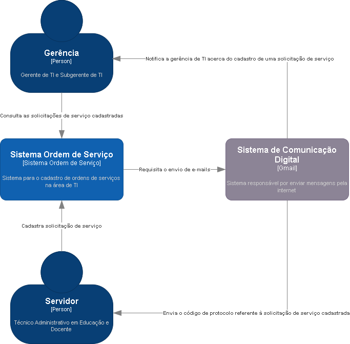
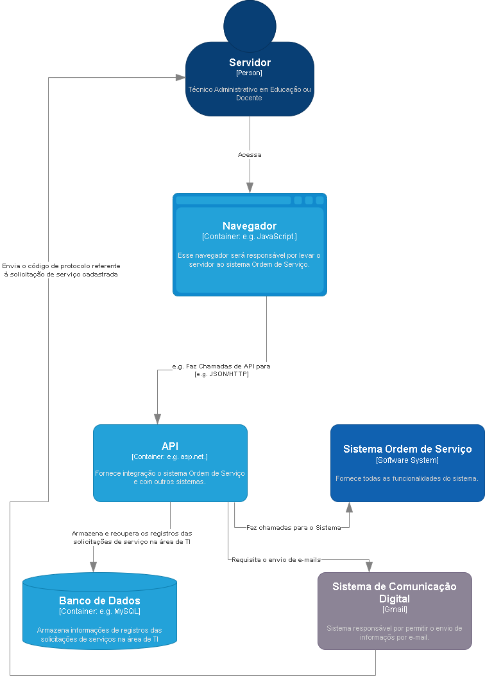
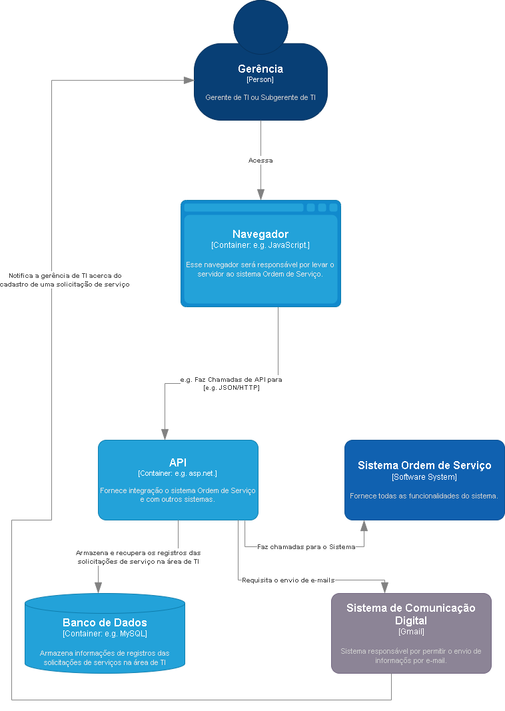

# DIAGRAMA DE CLASSES - ORDEM DE SERVIÇO

O Diagrama de Classes é uma das principais ferramentas da modelagem de software dentro da Programação Orientada a Objetos (POO). Ele oferece uma representação visual das classes que compõem um sistema, bem como das relações e interações entre elas. Sua função principal é auxiliar na organização e estruturação do código, proporcionando uma visão clara de como os objetos do sistema se relacionam e colaboram para realizar as funcionalidades desejadas.

No projeto do software Ordem de Serviço, o Diagrama de Classes serviu como um mapa que orientou o desenvolvimento, ajudando a equipe a entender a estrutura e a lógica interna do sistema. Ele definiu os atributos, métodos e associações das classes, facilitando a identificação de responsabilidades e promovendo um design mais coeso e modular. Além disso, o Diagrama de Classe foi fundamental para a comunicação entre desenvolvedores, arquitetos de software e demais stakeholders, garantindo que todos tenham um entendimento comum da arquitetura do sistema.

Ao antecipar possíveis problemas e inconsistências no design, o Diagrama de Classes contribuiu para a construção do software Ordem de Serviço, tornando-o mais robusto e manutenível, reduzindo riscos e facilitando futuras expansões ou alterações no sistema. Assim, ele desempenhou um papel crucial não apenas na fase de planejamento, mas ao longo de todo o ciclo de vida do desenvolvimento do software.

 
 
 
 

# MODELO C4

Nesse documento podemos encontrar duas visões do Sistema Ordem de Serviço, uma visão mais ampla, Nível de Contexto, destacando a posição do sistema e a interação com o ambiente externo, e outra visão simplificada da arquitetura do sistema, Nível de Container, destacando as tecnologias utilizadas e a maneira como ocorre a comunicação entre seus componentes.

## NÍVEL 1 - CONTEXTO

O nível de Contexto proporciona uma visão ampla do sistema, destacando sua posição e interação com o ambiente externo. Ele descreve como o sistema se relaciona com seu entorno, identificando claramente os principais atores externos, incluindo usuários e outros sistemas que possam interagir com ele. Nesse nível, são mostradas as interações entre esses atores e o sistema, evidenciando como as entradas e saídas são trocadas.

O nível de Contexto ajuda a definir os limites do sistema, deixando claro quais elementos fazem parte do escopo do projeto e quais são as suas principais conexões com o mundo externo.

## SISTEMAS EXTERNOS

1. Sistema de Comunicação Digital: Sistema para envio de informações por email. Esse sistema é responsável por enviar o código de protocolo, referente à solicitação de serviço cadastrada, para o servidor (docente ou Técnico Administrativo em Educação), como também é responsável por notificar a gerência de TI acerca do cadastro de uma solicitação de serviço.

 

## NÍVEL 2 - CONTAINER

O nível de Container apresenta uma visão simplificada da arquitetura do sistema, destacando as tecnologias utilizadas e a maneira como ocorre a comunicação entre seus componentes. Ele oferece uma representação mais detalhada do que a vista no nível de Contexto, descrevendo os principais elementos, como servidores, aplicativos e bancos de dados, além de mostrar como eles interagem.
 

O diagrama de Container inclui informações relevantes sobre os processos e protocolos de comunicação, ajudando a esclarecer como os diferentes elementos do sistema trabalham em conjunto. Esse nível de detalhamento é especialmente valioso para membros da equipe de desenvolvimento, arquitetos de software, profissionais de DevOps e outros envolvidos, pois facilita a compreensão das tecnologias em uso e da infraestrutura subjacente.

### Servidor

### Gerência

